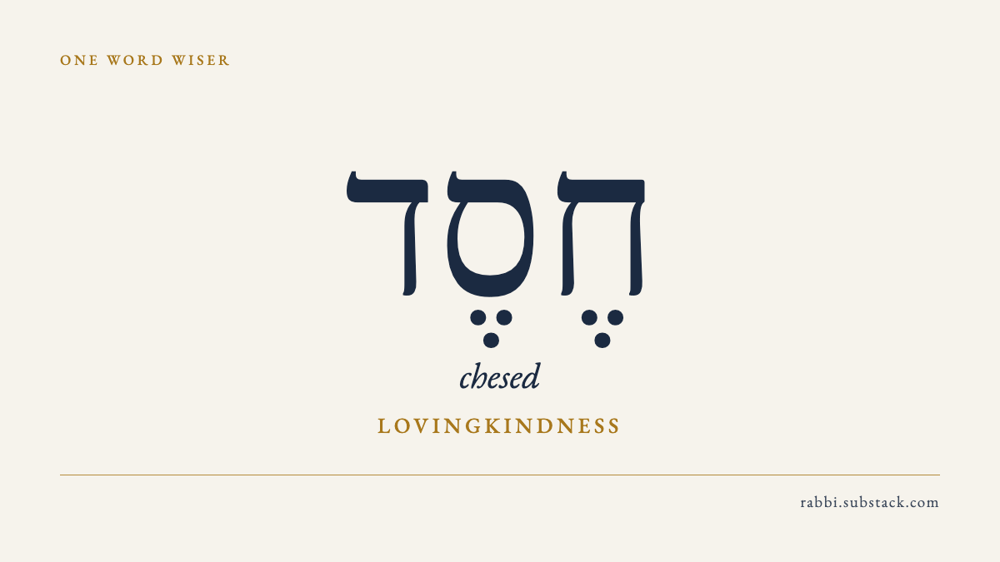

# September 24 — chesed discovery packet

**Subject:** Care begins with noticing
**Subtitle:** none
**Audience:** readers discovering One Word Wiser through Substack Notes
**Paywall:** the proposed Note is free; linked article contains a complete free Hebrew teaching and a paid continuation
**Status:** prepared for review only; no Note, post, schedule, profile change, outreach, or X publication performed
**Cards:** one cream/navy/gold Hebrew word card, 1200 × 675
**Dividers:** none
**Notes:** one standalone teaching, not a daily Notes schedule

---

*Chesed* (חֶסֶד) is often translated as lovingkindness.

In Psalm 136, “his love” is *chasdo*: *chesed* with an ending meaning “his.” The psalm praises the God who made the heavens and gives food to living creatures.

For us, care can begin with noticing an ordinary need. A meal. A ride. An unanswered message.

Read the free Hebrew teaching in [Is There a Hebrew Word for Amazing Grace?](https://rabbi.substack.com/p/is-there-a-hebrew-word-for-amazing?utm_source=substack&utm_medium=notes&utm_campaign=oww_discovery_20260924&utm_content=chesed-01). No Hebrew required.

---

## Recommendation

Use this as one small pilot of the [September 16 discovery plan](2026-09-16-substack-discovery-plan.md): a useful short Hebrew teaching, a recognizable word card and one gentle route into the free teaching. The Note works by itself and names the actual passage. It does not claim that the complete paid article is free.

The live homepage checked September 24 still features the September 17 chesed letter. This packet uses that latest observed publication; it does not invent a September 24 letter, label this as today's new teaching, or overwrite the user's live edits from an older local draft. The current public title is **Is There a Hebrew Word for Amazing Grace?**

The familiar cream, navy and gold word-card design is reused. It is a new dated asset without the older Morning/Evening label, preserving the prominent Hebrew, transliteration and meaning. No new decorative illustration, video, unpublished book or ongoing study-sheet benefit is promised. This packet belongs only to One Word Wiser and contains no cross-publication promotion. The X account is unconfirmed; no X action is included.

## Source notes

- [Psalm 136 in NIV](https://search.biblegateway.com/passage/?search=Psalm+136&version=NIV), checked September 24: verse 1 contains the refrain; verse 5 names the making of the heavens; verse 25 names food for every creature. The Note paraphrases these, quoting only “his love.” The intervening rescue and battle passages are not erased or summarized as though the whole psalm consists of gentle imagery.
- [Psalms 136:1, Hebrew](https://www.sefaria.org/Psalms.136.1?lang=bi), read in the live Sefaria UI September 24: חַסְדּוֹ is the form in the verse, with a possessive ending referring to God. The standalone noun חֶסֶד and *chesed* are distinguished from that inflected form. Sefaria's English is used for checking, not substituted for NIV quotation.
- [Live chesed letter](https://rabbi.substack.com/p/is-there-a-hebrew-word-for-amazing), read September 24. The source's useful word-form explanation is retained without copying the personal church recollection or paid Talmud discussion into this Note. The ordinary acts of care are editorial application, not a claim that they are the lexical definition of every occurrence of *chesed*.
- The archived Evernote item “The meaning of 'chesed' in the Hebrew Bible” supplied a focused research lead. Its sweeping lexical and etymological claims were not reused. The public biblical texts and dated source review provide the publishing evidence; no raw archive content is copied into this repository.
- The free teaching boundary was checked in the saved mobile free preview on September 17, recorded in `../posts/2026-09-17.md`. Its pertinent teaching remains in the live article. This is identified as reused evidence, not a fresh logged-out paywall test. Recheck the boundary before an authorized publication if the article changes.

## Review of the exact packet

| Check | Result | Evidence / limit |
|---|---|---|
| Useful takeaway and title | Pass | Divine care in the psalm is connected to ordinary noticing; the Note teaches a word form and passage independently. |
| Hebrew and source fidelity | Pass | Live Sefaria Hebrew and full NIV passage checked; noun and possessed form distinguished; no invented etymology. |
| Voice and respect | Pass | Short paragraphs, no urgency, no invented autobiographical material, no claim of one universal Jewish or Christian reading. |
| Free teaching and paid offer | Pass, with reused boundary evidence | Note itself is complete and free; CTA says free teaching rather than full free article; September 17 preview reused. |
| Rendered card | Pass | Final 1200 × 675 PNG visually checked for Hebrew, niqqud, legibility and clipping; canonical template reused. |
| Reading structure | Pass locally | Short text and standalone card; this is not a claim of a saved Substack phone preview. |
| Saved phone preview and platform draft | Pending authorized upload | No Note draft was created in Substack. |
| Approval and delivery | Pending | The current action authorizes preparation; no public delivery is inferred. |

This is the preparer's own review, not an independent-agent review. Exact copy and image hashes are in [the manifest](assets/2026-09-24/manifest.json). The reusable source is [note.md](assets/2026-09-24/note.md); the image is [chesed-word-card.png](assets/2026-09-24/chesed-word-card.png). Render source [HTML](assets/2026-09-24/chesed-word-card.html) uses `brand/cards/render.py`'s word-card layout with blank date/label and the correctly spelled Frank Ruhl Libre font family in this asset. The shared template is unchanged.

## After a separately authorized publication

Verify the One Word Wiser profile and check for an existing equivalent Note before posting. Preserve the exact reviewed copy, card and alt text. Confirm the saved/public state and record the real Note URL and delivery time. Do not link this public identity to another publication.

At 72 hours and seven days, collect Note views/impressions, meaningful replies, clicks, follows, free subscriptions and gross paid starts where shown. Keep follows distinct from email subscriptions and gross starts distinct from net list change. Missing attribution stays unavailable. Compare other Notes at similar ages, not publication post cards of a different age. One result will not prove that the card caused growth. Review preparation effort alongside acquisition before expanding the proposed cadence.

No current growth result is claimed for this new packet. The September 16 source figures in the discovery plan are historical context, not refreshed September 24 analytics.
